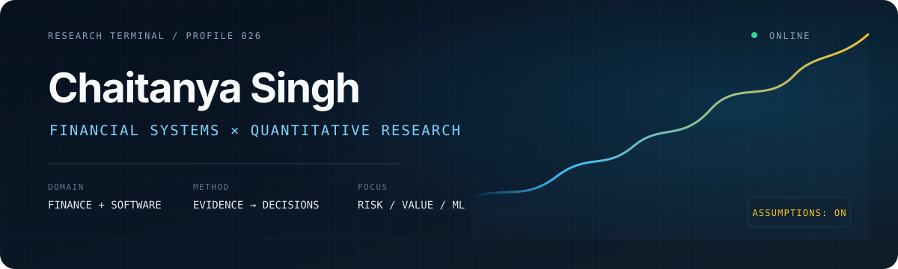

<p align="center">
  
</p>

<p align="center">
  <a href="mailto:singh.chaiitanya@gmail.com">Email</a>
  &nbsp;·&nbsp;
  <a href="https://www.linkedin.com/in/chaitanya-singh-10065a213">LinkedIn</a>
  &nbsp;·&nbsp;
  <a href="https://chaitanyasingh.org">Portfolio</a>
</p>

## Finance is the problem domain. Software is the leverage.

I build research systems that make financial reasoning inspectable—from the source data and assumptions to the calculation, model and decision. My work sits at the intersection of **financial analysis**, **quantitative research** and **production software engineering**.

I am a computer science student at **Arizona State University**, currently focused on accounting, valuation, portfolio risk, credit, fraud and time-aware machine learning.

> **Working principle:** a useful model should expose what it assumes, show where its evidence came from and remain honest when a simple baseline wins.

## Selected research systems

| | Project | Research question | What it demonstrates |
|:--:|---|---|---|
| **01** | **QuantEdge**<br><sub>Flagship · private</sub> | How do filing evidence, market risk and valuation fit into one research workflow? | Multi-perspective equity research, scenario analysis, provenance and trust-labeled outputs. |
| **02** | **[LedgerLens](https://github.com/CSingh26/LedgerLens)** | Do earnings, cash generation and balance-sheet changes tell a consistent story? | SEC filing normalization, three-statement relationships, capital efficiency and evidence exports. |
| **03** | **[IntrinsicLab](https://github.com/CSingh26/IntrinsicLab)** | What must be true about a company’s economics for its valuation to make sense? | FCFF, WACC, terminal value, comparables and assumption sensitivity. |
| **04** | **[PortfolioPilot](https://github.com/CSingh26/PortfolioPilot)** | Where does portfolio risk actually come from? | Risk contribution, downside analysis, optimization, costs and historical strategy evaluation. |

### Risk, credit and forecasting

- **[CreditLens](https://github.com/CSingh26/CreditLens)** connects default probability, loss severity, exposure and loan pricing to calibration and threshold economics.
- **[FraudPulse](https://github.com/CSingh26/FraudPulse)** evaluates fraud detection through missed-loss exposure, investigation cost and strictly prior account behavior.
- **[ChronosResearch](https://github.com/CSingh26/ChronosResearch)** tests whether market predictors survive purged, chronological out-of-sample evaluation against simple baselines.

## How I work

```text
QUESTION  →  ASSUMPTIONS  →  DATA CONTRACT  →  MODEL  →  VALIDATION  →  INTERPRETATION
               visible         traceable        tested      honest          bounded
```

| Principle | In practice |
|---|---|
| **Evidence before output** | Preserve source tags, periods, retrieval context and versioned artifacts. |
| **Uncertainty stays visible** | Separate observed data, user assumptions, synthetic demonstrations and model estimates. |
| **Time has direction** | Fit preprocessing on the past, purge overlapping labels and reserve untouched future observations. |
| **Baselines earn respect** | Compare complex models with transparent alternatives and report when complexity does not win. |
| **Calculations are contracts** | Use typed boundaries, numerical checks and reproducible exports from engine to interface. |

## Technical toolkit

| Domain | Tools I use |
|---|---|
| **Financial research** | Financial statements, DCF, WACC, capital efficiency, portfolio theory, credit and scenario analysis |
| **Quantitative & ML** | Python, pandas, NumPy, scikit-learn, TensorFlow, time-series validation, model evaluation |
| **Applications & data** | TypeScript, React, Next.js, FastAPI, Node.js, PostgreSQL, Prisma, REST APIs |
| **Systems & delivery** | Git, Docker, Linux, AWS, CI, test automation, data provenance and reproducible workflows |

## Beyond finance

- **[ReliScore](https://github.com/CSingh26/ReliScore)** — predictive-maintenance research across telemetry, temporal labels, training, inference and fleet triage.
- **[QuizBee](https://github.com/CSingh26/quiz-app)** — authenticated assessment workflows, grading and transactional persistence.
- **[Gridesign](https://github.com/CSingh26/Gridesign)** — responsive interface engineering and resilient service integrations.

---

<p align="center">
  <strong>Interested in financial research, risk systems and evidence-driven software.</strong><br />
  <sub>Explore the repositories above or <a href="mailto:singh.chaiitanya@gmail.com">start a conversation</a>.</sub>
</p>
